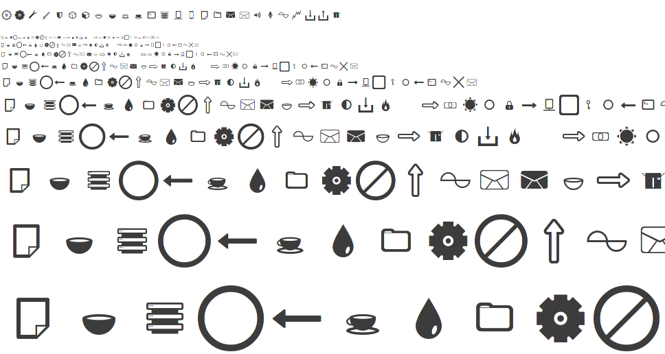

# Journey Glyph Font
Journey Glyph is a basic open source icon font for web development.
Free to use, copy, modify, and redistribute under the [SIL Open Font License](http://scripts.sil.org/cms/scripts/page.php?item_id=OFL).

## Usage
Import the stylesheet in html:
'''html
<link href="/fonts/Journey_Glyph_v1.css" type="text/css" rel="stylesheet">
'''

Now you can use the glyphs anywhere on your page by using special classes:
'''html

'''

You can also overlay glyphs on each other:
'''html

'''

easily resize glyphs with small/medium/large classes:
'''html

'''

The glyphs are standard font characters, so you can use css to color, transform,
and animate the glyphs to your heart's content:
'''html

'''

## contact
Feel free to contact me with any comments, issues, and offers.
I'm always open to suggestions.
